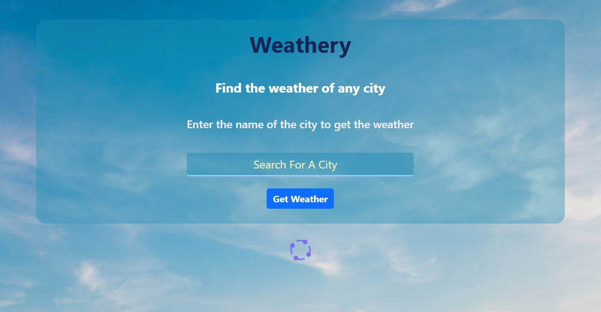

# 🌦️ Weather App

A modern and responsive weather application built with **HTML, CSS, and JavaScript** that provides real-time weather information and a 5-day forecast using the **OpenWeather API**.

---

## 🌐 Live Demo

👉 https://weather-app-kohl-six-xhyko409ml.vercel.app/

---

## ✨ Features

- 🌍 Search weather by city name
- 🌡️ Display current temperature
- ☁️ Show current weather condition
- 📅 5-Day weather forecast
- ⚡ Real-time weather data
- 📱 Fully responsive design
- 🎨 Clean and modern user interface

---

## 🛠️ Tech Stack

- HTML5
- CSS3
- JavaScript (ES6)
- OpenWeather API
- Font Awesome
- Vercel


##  📸 Screenshots

<p align="center">
  
  
  
</p>

---

## ⚙️ Installation

Clone the repository:

```bash
git clone https://github.com/Mohamedxismail/Weather-App.git
```

Go to the project folder:

```bash
cd Weather-App
```

Open the project using **Live Server** or simply open `index.html` in your browser.

---

## 📂 Project Structure

```
Weather-App/
│
├── css/
├── js/
├── images/
├── webfonts/
├── index.html
└── README.md
```

---

## 🚀 Deployment

The project is deployed on **Vercel**.

👉 https://YOUR-VERCEL-LINK.vercel.app

---

## 👨‍💻 Author

**Mohamed Ismail**

- GitHub: https://github.com/Mohamedxismail
- LinkedIn: www.linkedin.com/in/mohamed-ismail-81217a33b
